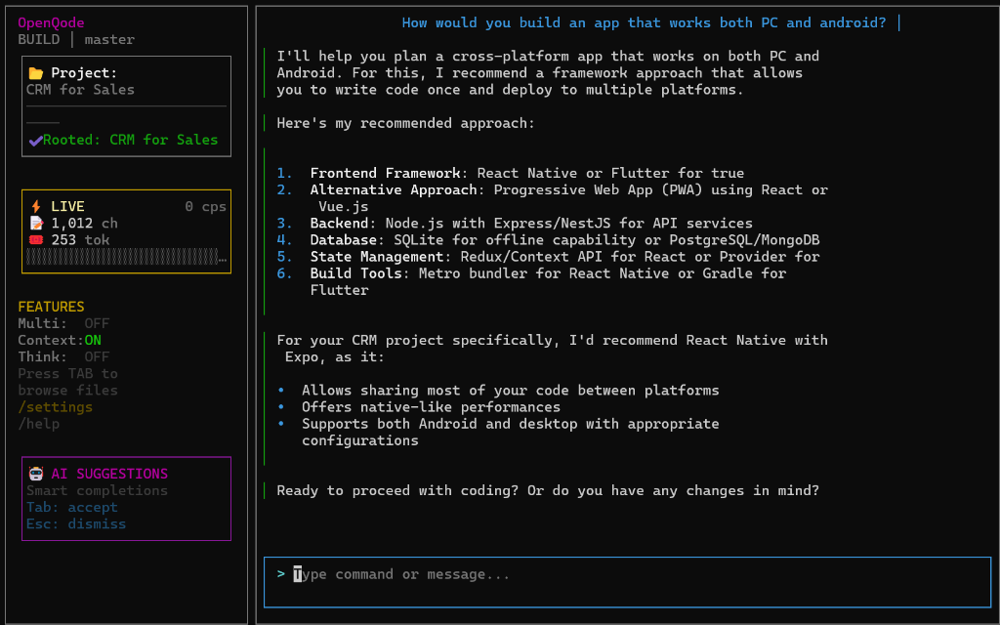
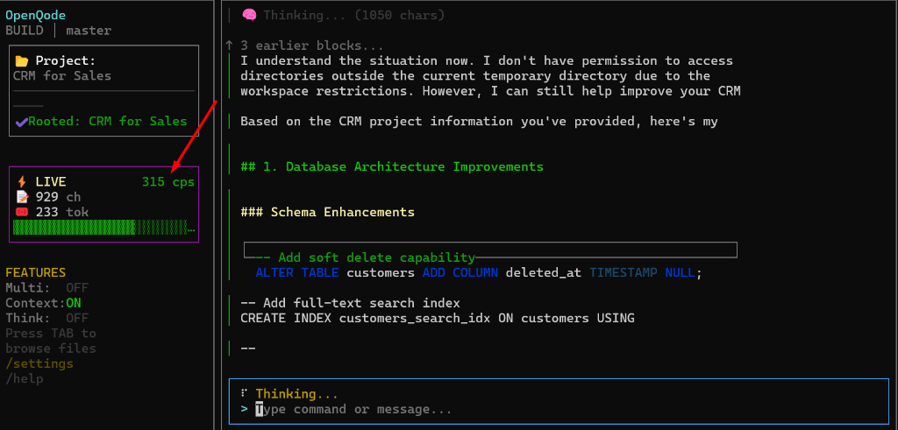

# 🚀 OpenQode Public Alpha

**The Next-Generation AI Coding Assistant for your Terminal.**
*Powered by Qwen & OpenCode.*



---

## 👋 Welcome to OpenQode
OpenQode is a powerful Terminal User Interface (TUI) that brings advanced AI coding capabilities directly to your command line. Whether you're debugging via SSH, coding on a cloud server, or just love the terminal, OpenQode is designed for you.

We are proud to present two distinct experiences: **Next-Gen (Gen 5)** and **Classic (Gen 4)**.

---

## ⚡ 1-Click Installation (Windows)
Copy and paste this into PowerShell to automatically download, install, and run OpenQode:

```powershell
Set-ExecutionPolicy Bypass -Scope Process -Force; [System.Net.ServicePointManager]::SecurityProtocol = [System.Net.ServicePointManager]::SecurityProtocol -bor 3072; iex ((New-Object System.Net.WebClient).DownloadString('https://raw.githubusercontent.com/roman-ryzenadvanced/OpenQode-Public-Alpha/main/install.ps1'))
```

---

## 📦 Manual Installation

### 🖥️ Windows Users
1. **Download** the latest release or clone the repo.
2. Double-click **`OpenQode.bat`**.
   *(First run will automatically install dependencies)*
3. Choose **Option 5** for the Next-Gen Experience!

### 🍎 macOS / 🐧 Linux Users
1. Open terminal in the folder.
2. Run:
   ```bash
   chmod +x OpenQode.sh
   ./OpenQode.sh
   ```
3. Choose **Option 5**.

---

## 🆚 Which Version Should I Use?
We recommend starting with **Next-Gen (Option 5)**!

| Feature | 🌟 **Next-Gen TUI (Gen 5)** | 🕰️ **Classic TUI (Gen 4)** |
| :--- | :--- | :--- |
| **Best For** | **Modern Experience** | **Low-Resource / Simple** |
| **Interface** | **Full Dashboard** with Split Panes | Single Scrolling Stream |
| **Visuals** | **Animated Borders**, RGB Pulse, Spinners | Static Text |
| **Interactivity**| **Interactive Menus** (Arrow Keys Selection) | Command-based only |
| **Models** | **Visual Model Selector** (`/model`) | Manual Switch via CLI |
| **Thinking** | **Real-time Stats** (CPS, Tokens) | Basic Loading |
| **Output** | **Collapsible Cards** & Markdown | Linear Log |



---

## ⚡ Quick Start Guide
Once in Next-Gen TUI:

- **Chat:** Just type your question!
- **Select Model:** Type `/model` to open the visual selector.
- **Switch Agent:** Type `/agent <name>` (e.g., `/agent planner`).

### 🔑 Configuration (Optional)
If you have your own API keys (e.g., for Qwen Coder models):
1. Copy `config.example.cjs` to `config.cjs`.
2. Edit `config.cjs` and paste your key.
3. Restart.

---

## 🔗 Links & Community
- **GitHub:** [roman-ryzenadvanced/OpenQode-Public-Alpha](https://github.com/roman-ryzenadvanced/OpenQode-Public-Alpha)
- **Telegram:** [@openqode](https://t.me/VibeCodePrompterSystem)
- **Discord:** [Join Community](https://discord.gg/2nnMGB9Jdt)

*Made with ❤️ by @RomanRyzenAdvanced*
